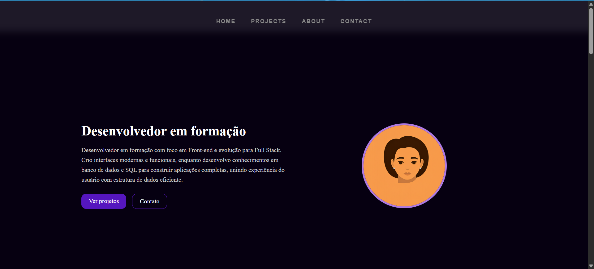

# 🚀 Portfólio - João Vitor Gonçalves

Aplicação web desenvolvida para apresentar meus projetos, habilidades e evolução como desenvolvedor.

🔗 **Acesse o projeto:**
https://joaovitorgoncalvessantos1.github.io/Portifolio/

---

## 🧠 Sobre o projeto

Este portfólio foi criado com o objetivo de centralizar meus principais projetos e demonstrar minhas habilidades em desenvolvimento web.

A aplicação apresenta uma interface moderna, com navegação fluida e foco na experiência do usuário, além de destacar minha evolução na área de tecnologia.

---

## 🎯 Problema → Solução

**Problema:**
Não ter um espaço organizado para apresentar projetos e habilidades de forma profissional.

**Solução:**
Desenvolvi um portfólio responsivo e estruturado, onde é possível visualizar meus projetos, tecnologias e trajetória de aprendizado de forma clara e objetiva.

---

## 🛠️ Tecnologias utilizadas

* HTML
* CSS
* JavaScript
* Git & GitHub
* SQL

---

## 💡 Funcionalidades

* Navegação com scroll suave
* Navbar fixa
* Layout responsivo
* Seções organizadas (Sobre, Tecnologias, Projetos, Formação e Contato)
* Integração com links externos (GitHub e LinkedIn)

---

## 📚 Formação e aprendizado

* Engenharia de Software (em andamento)
* Cursos de desenvolvimento web pela Alura
* Estudos em JavaScript, Front-end e Banco de Dados
* Curso de Programador Web (200h)

---

## 📌 Projetos em destaque

* 🎬 CineTrack
* 💰 Nexos (Controle Financeiro)
* 🌦️ SkyCast (Clima)
* 🔳 Gerador de QR Code

---

## 📷 Preview

---

## 📬 Contato

* 📧 Email: [joaovitorgoncalvessantos16@gmail.com](mailto:joaovitorgoncalvessantos16@gmail.com)
* 💼 LinkedIn: https://www.linkedin.com/in/jo%C3%A3o-vitor-gon%C3%A7alves-4a47491a4/
* 💻 GitHub: https://github.com/joaovitorgoncalvessantos1

---

## 🚀 Status do projeto

✅ Em desenvolvimento contínuo

---

## 💭 Melhorias futuras

* Adicionar novos projetos
* Implementar versão em React
* Melhorar animações e interações
* Integração com APIs reais

---

## 📄 Licença

Este projeto está sob a licença MIT.

---

💡 Desenvolvido por João Vitor Gonçalves
